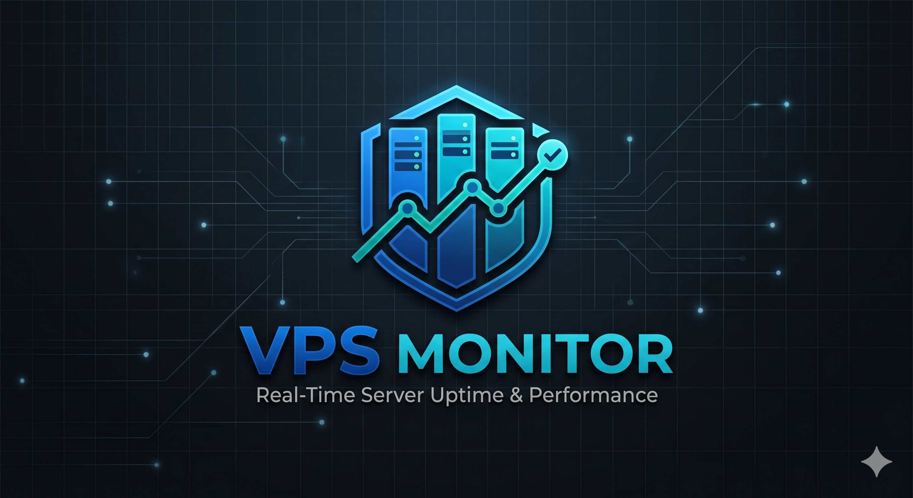
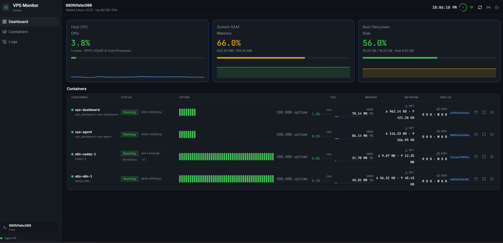

# 🖥️ VPS Dashboard

<div align="center">
  
  <br /><br />
  
  
  
  
  <br /><br />
  
  
  
  
  
  
</div>

<p align="center">
  
</p>

## 📋 Overview

A self-hosted, real-time **VPS monitoring dashboard** built with **Next.js 14 App Router** and a lightweight **Node.js agent**. Monitor your Docker containers, host system resources, and uptime history — all from a clean, dark-themed UI — without relying on any third-party cloud service.

## ✨ Features

### 📊 System Monitoring
- **Host CPU** — real-time usage with core count and processor model
- **System RAM** — used / total with color-coded progress bar (excludes page cache)
- **Root Filesystem** — disk usage and free space at a glance
- **Uptime** — system uptime displayed in the header

### 🐳 Container Management
- **Live container list** — one container per row with all stats inline
- **Per-container stats** — CPU %, memory usage, network I/O, disk I/O
- **Start / Stop / Restart** actions with optimistic UI updates
- **Port mappings** shown inline (deduplicated IPv4/IPv6 entries)
- **Uptime history** — tick bar (last 90 polls) clipped to available width
- **30-day daily uptime blocks** — green / yellow / red based on uptime %
- **Container detail page** — full logs viewer, live stats, and uptime breakdown

### 🔒 Security
- Agent runs inside Docker on a private network — never exposed to the internet
- All browser-to-agent traffic proxied through Next.js `/api/agent` routes
- `AGENT_TOKEN` lives only in server-side environment variables; never sent to the client

### 🎨 Design & UX
- **Dark-first UI** using a custom VPS color palette
- **Responsive** — works on desktop, tablet, and mobile
- **Skeleton loaders** and animated fade-in rows
- **Pulse glow** on running container indicators
- **Caddy reverse proxy** ready — ships with `caddy_net` Docker network support

## 🛠️ Technology Stack

| Layer | Technology |
|-------|-----------|
| Framework | Next.js 14 App Router + React |
| Language | TypeScript |
| Styling | Tailwind CSS + Shadcn UI |
| Data Fetching | SWR (stale-while-revalidate) |
| Agent | Node.js + Express |
| Database | SQLite (uptime history) |
| Containerisation | Docker + Docker Compose |
| Reverse Proxy | Caddy |

## 📁 Project Structure

```
VPS_Dashboard/
├── app/                          # Next.js App Router
│   ├── icon.png                  # Favicon (auto-detected by Next.js)
│   ├── layout.tsx                # Root layout + providers
│   ├── page.tsx                  # Redirects to /dashboard
│   ├── dashboard/                # Main dashboard page
│   ├── containers/               # Container list page
│   │   └── [id]/                 # Container detail page
│   ├── logs/                     # Logs viewer page
│   └── api/
│       └── agent/[...path]/      # Server-side proxy → vps-agent
├── components/
│   ├── dashboard/
│   │   ├── DashboardView.tsx     # Top-level dashboard layout
│   │   ├── SystemOverview.tsx    # CPU / RAM / Disk stat cards
│   │   ├── ContainerGrid.tsx     # Container list with header row
│   │   ├── ContainerCard.tsx     # Single-row container entry
│   │   ├── UptimeBlocks.tsx      # Uptime tick bar + daily blocks
│   │   └── StatSparkline.tsx     # Mini sparkline chart
│   ├── layout/
│   │   ├── DashboardShell.tsx    # Sidebar + TopBar shell
│   │   ├── Sidebar.tsx           # Desktop navigation sidebar
│   │   ├── TopBar.tsx            # Top header bar
│   │   └── MobileNav.tsx         # Bottom mobile navigation
│   └── container/
│       └── ContainerActions.tsx  # Start / Stop / Restart buttons
├── lib/
│   └── agent.ts                  # Typed API client for vps-agent
├── hooks/                        # SWR data hooks
├── types/                        # Shared TypeScript types
├── vps-agent/                    # Standalone Node.js monitoring agent
│   ├── agent.js                  # Express server + Docker polling
│   └── Dockerfile
├── docker-compose.yml
└── Dockerfile
```

## 🚀 Getting Started

### Prerequisites
- A Linux VPS with Docker & Docker Compose installed
- Caddy (or any reverse proxy) configured with a `caddy_net` Docker network

### 1. Clone the repository
```bash
git clone https://github.com/your-username/VPS_Dashboard.git
cd VPS_Dashboard
```

### 2. Create your `.env` file
```env
AGENT_TOKEN=your_secret_token_here
```

### 3. Create the shared Docker network (once)
```bash
docker network create caddy_net
```

### 4. Start the stack
```bash
mkdir -p data
docker compose up -d --build
```

The dashboard will be available on port `3002` (or via your reverse proxy domain).

### Example Caddy configuration
```caddy
monitor.yourdomain.com {
    reverse_proxy vps-dashboard:3000
}
```

## ⚙️ Configuration

| Variable | Where | Description |
|----------|-------|-------------|
| `AGENT_TOKEN` | `.env` | Shared secret between dashboard and agent |
| `AGENT_URL` | docker-compose (server) | Internal URL to reach vps-agent |
| `NEXT_PUBLIC_AGENT_URL` | docker-compose (client) | Proxy path baked into the browser bundle |
| `POLL_INTERVAL_SECONDS` | docker-compose | How often the agent polls Docker stats |
| `DB_PATH` | docker-compose | SQLite file path for uptime history |

## 🔄 CI / CD

The repo includes a GitHub Actions workflow that SSHs into your VPS on every push to `main`, pulls the latest code, rebuilds containers, and prunes old images automatically.

```yaml
- name: Deploy
  run: |
    cd /root/VPS_Dashboard
    git pull origin main
    echo "AGENT_TOKEN=${{ secrets.AGENT_TOKEN }}" > .env
    mkdir -p data
    docker compose down
    docker compose up -d --build
    docker image prune -f
```

Set `AGENT_TOKEN`, `SSH_HOST`, `SSH_USER`, and `SSH_KEY` as GitHub repository secrets.

## 🖥️ Key Pages

### 🏠 Dashboard
- System resource overview (CPU, RAM, Disk)
- Full container list with live stats, uptime bars, and action buttons — one container per row

### 📦 Containers
- Same row-based list with status, image, and port details

### 📄 Container Detail
- Live-tailing logs with configurable tail length
- Real-time CPU / memory sparklines
- 30-day daily uptime blocks with incident breakdown

### 📋 Logs
- Aggregated log viewer across all containers

## 🎯 Roadmap

- [ ] Alert notifications (email / Telegram) on container down
- [ ] Multi-host support
- [ ] Historical CPU / RAM charts (time-series)
- [ ] Custom polling intervals per container
- [ ] Mobile PWA support

## 📄 License

This project is licensed under the MIT License.

## 📞 Contact

GitHub: [https://github.com/your-username/VPS_Dashboard](https://github.com/your-username/VPS_Dashboard)

---

<p align="center">Built with ❤️ by the VPS Dashboard contributors</p>
